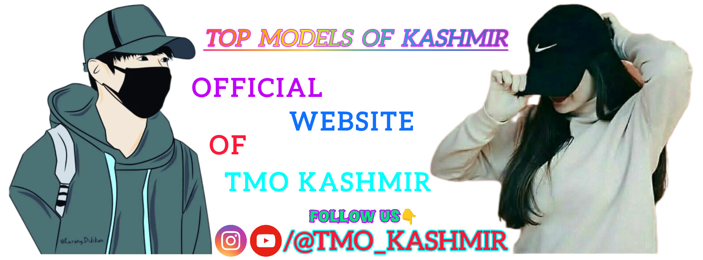

***📢IMPORTANT:Website Under maintenance⚠️***
**👉Update By-#TMO_K Admin Haroon**

# Top Models of Kashmir - Official Website

Welcome to the official website of **Top Models of Kashmir** (@tmo_kashmir), a platform that showcases the finest models from Kashmir and offers collaboration opportunities for photographers, brands, and influencers.

## Overview

**Top Models of Kashmir** is an Instagram page that highlights the beauty, fashion, and talent of Kashmiri models. We collaborate with photographers, models, and brands to create stunning content and promote the vibrant fashion scene in Kashmir.

## Website Features

- **Free and Paid Collaboration Opportunities**: We offer both free and paid collaboration opportunities for models, photographers, and brands.
- **Instagram Feed**: Displaying the latest Instagram posts from our page.
- **Contact Form**: For inquiries and collaboration requests.
- **Responsive Design**: The website is mobile-friendly and optimized for all devices.

## How to Contribute

If you're a model, photographer, or brand interested in collaborating with us, you can:

1. **Fill out the contact form** on the website.
  Contact Form
 <form action="https://getform.io/f/bqoodkdb" method="POST" style="display:flex; flex-direction:column; max-width:400px;">
 <label for="name">Name:</label>
 <input type="text" id="name" name="name" required style="margin-bottom:10px; padding:5px;">
  
 <label for="email">Email:</label>
 <input type="email" id="email" name="email" required style="margin-bottom:10px; padding:5px;">

  <label for="message">Message:</label>
  <textarea id="message" name="message" rows="4" required style="margin-bottom:10px; padding:5px;"></textarea>
  
  <button type="submit" style="padding:10px; background-color:blue; color:white; border:none;">Submit</button>
</form>
2. Reach us via Instagram at [@tmo_kashmir](https://www.instagram.com/tmo_kashmir).

## Thanks For Reading
Regards TMO Kashmir Admin **HAROON**
